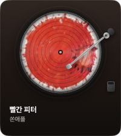

# Turntable

현재 재생 중인 음악을 회전하는 LP 판으로 보여주는 macOS 데스크톱 위젯입니다.
앨범 아트가 판 전체를 채우고 33⅓ RPM으로 돌며, 재생 위치는 숫자 대신 **톤암 바늘의 위치**로 표현됩니다.



## 요구 사항

- macOS 13 이상
- [`nowplaying-cli`](https://github.com/kirtan-shah/nowplaying-cli) — `brew install nowplaying-cli`

## 실행

```bash
./Scripts/install.sh        # 릴리스 빌드 → /Applications 설치 → 실행 (Spotlight 등록)
./Scripts/run.sh            # 빌드 후 프로젝트 폴더에서 바로 실행 (debug)
./Scripts/bundle.sh         # 배포용 Turntable.app 생성만 (release)
```

코드를 고친 뒤에는 `install.sh` 를 다시 돌려야 `/Applications` 쪽이 갱신됩니다.
복사하면 ad-hoc 서명이 깨지므로 스크립트가 설치 위치에서 재서명합니다.

위젯은 아무 곳이나 드래그해서 옮길 수 있고, 위치는 다음 실행 때 복원됩니다.

### 켜기

`/Applications` 에 설치되어 있으면 **Spotlight(⌘Space) → "Turntable"** 로 실행합니다.
Finder 에서 더블클릭하거나 터미널에서 열어도 됩니다.

```bash
open -a Turntable
```

### 투명도

위젯을 **우클릭 → 투명도** 에서 불투명 / 90% / 75% / 60% / 45% 중에 고릅니다.
선택은 저장되어 다음 실행 때 복원됩니다.

메뉴에 닿지 못하는 상황이라면 값을 직접 써도 됩니다. 앱을 다시 띄우면 반영됩니다.

```bash
defaults write com.lp.turntable opacity -float 0.75
```

45% 아래로는 내려가지 않습니다. 메뉴바 아이템을 항상 기대할 수 없는 상태에서 위젯이
완전히 투명해지면 다시 찾을 방법이 없기 때문입니다.

### 끄기

- 위젯을 **우클릭** → 종료
- 메뉴바의 디스크 아이콘 → 종료
- 터미널에서 `pkill -x Turntable`

메뉴바 아이콘은 보이지 않을 수 있습니다. macOS 는 메뉴바에 자리가 없으면 상태 아이템을
조용히 드러내지 않는데, 주 디스플레이가 세로 모니터처럼 좁으면 쉽게 그렇게 됩니다
(아이템 자체는 생성되어 있고 `isVisible` 도 true 입니다). 우클릭 메뉴를 함께 둔 이유가
이것입니다.

## 동작 방식

메타데이터는 macOS의 MediaRemote 프레임워크에서 옵니다 (`nowplaying-cli get-raw`).
YouTube Music, Spotify, Apple Music 등 MediaRemote 에 정보를 싣는 앱이면 모두 잡힙니다.

재생 위치에는 한 가지 우회가 필요합니다. MediaRemote 는 YouTube Music PWA 의 경과 시간을
**약 60초에 한 번씩만** 갱신하고, 보간에 쓸 수 있는 `Timestamp` 키도 주지 않습니다.
그래서 `NowPlayingMonitor` 는 보고된 값이 바뀌는 순간을 붙잡아 그 시점을 기준으로 삼고,
이후로는 자체 시계로 위치를 진행시킵니다. 판이 부드럽게 도는 것도, 바늘이 조금씩
안쪽으로 들어오는 것도 이 보간 위에서 동작합니다.

`nowplaying-cli get elapsedTime` 서브커맨드는 항상 0 을 반환하므로 쓰지 않고,
`get-raw` 의 `kMRMediaRemoteNowPlayingInfoElapsedTime` 을 직접 읽습니다.

## 톤암 기하

바늘은 곡 시작에 판 바깥 가장자리(반경의 94%)에 놓이고, 끝나면 **가장 안쪽 그루브 링**
위에 멈춥니다. 그 반경은 `VinylDisc.innermostGrooveRatio` 하나에서 나오므로 그루브를
다시 그리면 톤암의 종료 지점도 함께 따라옵니다.
각도는 피벗·스핀들·바늘이 이루는 삼각형에 코사인 법칙을 적용해, 목표 반경에서 역산합니다.
진행도를 각도에 그대로 비례시키면 안쪽으로 갈수록 어긋나기 때문입니다.

여기에는 한 가지 제약이 있습니다. 바늘이 스핀들까지 도달하려면 **암 길이가
피벗–스핀들 거리와 같아야** 합니다. 암이 더 길면 바늘이 중심에 닿지 못하고
`|거리 − 길이|` 만큼 떨어진 곳에서 멈춰, 톤암이 판 위를 거의 움직이지 않는 것처럼
보입니다. 그래서 `tubeLength` 는 상수가 아니라 피벗 좌표에서 계산됩니다 —
피벗을 옮기면 암 길이가 따라옵니다.

부호 규약도 함정입니다. `rotationEffect(.degrees(θ))` 는 암의 정하방 축을 `(-sinθ, cosθ)`
로 보내므로, 익숙한 `atan2(x, y)` 형태를 그대로 쓰면 수평 성분의 부호가 뒤집힙니다.
그러면 암이 판 중심의 정반대로 돌아가 판 바깥에서만 움직입니다.

곡 전체에 걸친 스윙은 약 44도입니다. 1분에 몇 도씩이라 순간적으로는 잘 보이지 않지만,
곡이 진행되면 바늘이 확실히 안쪽으로 들어옵니다.

## 판 회전

회전은 재생 위치가 아니라 **별도의 회전 전용 시계**로 돕니다. 위치 보간은 MediaRemote 가
경과 시간을 다시 실을 때마다 1~2초씩 보정되는데, 200°/s 에서 그 보정은 수십~수백 도의
점프가 되어 판이 눈에 띄게 튑니다. 회전 위상은 아무 정보도 담지 않으므로 재생 중일 때
단조 증가만 하면 충분하고, 그래서 `spinSeconds` 를 `position` 과 분리했습니다.

부수 효과로 탐색(seek)을 해도 판은 튀지 않고 계속 돕니다 — 실제 턴테이블에서 바늘만
옮기는 것과 같습니다.

일시정지하면 판이 멈추고 **톤암이 판 밖 거치대로 물러납니다**.

처음에는 실제 큐잉처럼 암을 수직으로 들어 올렸는데(확대 + 오프셋 + 그림자 확산), 아무리
과장해도 "들린" 것으로 읽히지 않았습니다. 이유는 시점에 있습니다 — **실물 턴테이블도 바로
위에서 내려다보면 톤암이 들렸는지 알 수 없습니다.** 3~5mm 뜰 뿐이라, 실제로 상태를
알려주는 건 큐 레버의 위치이거나 암이 거치대에 놓였는지입니다. 그림자로 높이를 표현하는
방법도 여기서는 막힙니다. 그림자가 떨어지는 곳이 앨범 아트라, 어두운 커버 위에서는
물리적으로 옳은 옅은 그림자가 그냥 사라집니다.

그래서 Vinylage 같은 실사 턴테이블 앱이 하는 대로 암을 아예 판 밖으로 보냅니다.
`restAngle` 로 회전하면 바늘이 판을 벗어나 거치대 위에 얹히고, 0.55초에 걸쳐 오갑니다.
거치대는 헤드셸보다 넓게 그려서 암이 얹혀도 가려지지 않습니다.

들어 올리는 느낌은 **이동하는 동안만 암을 짧게** 만들어서 냅니다. 암이 플래터 평면
밖으로 기울면 위에서 본 투영 길이가 `cos θ` 만큼 줄어들므로, 축소가 곧 "떴다"는 신호가
됩니다(확대는 정확히 반대 방향입니다).

줄어드는 것은 **암 축을 따라 놓인 부품뿐**입니다 — 튜브와 카운터웨이트만 `cos θ` 를
곱하고, 피벗 지름과 헤드셸은 그대로 둡니다. 뷰 전체에 `scaleEffect` 를 걸면 간단하지만
피벗이 타원으로 눌립니다. 피벗은 회전 중심이라 암이 아무리 들려도 자리도 모양도 변하지
않아야 합니다. 30° 에서 튜브는 70.6 → 61.1pt 로 줄고 피벗은 10pt 그대로입니다.

애니메이션하는 값은 길이가 아니라 **기울기 각도** 입니다. 길이는 그 `cos` 로 파생됩니다.
cos 은 0° 근처에서 평평하고 30° 근처에서 가파르기 때문에, 각도를 easeOut 으로 굴리면
길이는 저절로 양끝이 느리고 가운데가 빠른 곡선이 됩니다. 길이를 직접 easing 하면 반대로
시작에서 튀고 끝에서 기어갑니다.

| t | θ | cos θ (각도 구동) | 길이 직접 easing |
|---|---|---|---|
| 0.25 | 13.1° | −0.026 | −0.059 |
| 0.50 | 22.5° | −0.050 | −0.042 |
| 0.75 | 28.1° | −0.042 | −0.025 |
| 1.00 | 30.0° | −0.016 | −0.008 |

큐잉 기구는 올릴 때 튕기듯 올라가고 내릴 때는 댐퍼로 천천히 내려오므로, 올림 0.16초 /
내림 0.28초로 비대칭입니다. 그림자는 높이 `sin θ` 에 연동해 함께 퍼지고 옅어집니다.

## 앨범 아트

아트 갱신은 곡 제목이 아니라 **아트 데이터 자체의 지문**으로 판단합니다.
MediaRemote 는 새 제목을 새 아트보다 한 박자 먼저 싣는 경우가 있어서, 제목을 키로 쓰면
그 순간 붙어 있던 이미지(대개 직전 곡의 것)를 확정해 버리고 진짜 아트가 도착해도
무시하게 됩니다. 곡이 바뀌었는데 이전 커버가 계속 돌아가는 증상이 이것입니다.

아트 원본은 120×120 입니다. 판 지름이 134pt 라 살짝 확대해 쓰고 있어서, 위젯을 더
키우면 이미지가 뭉개집니다.

## 진단

```bash
# 톤암 궤적을 기다리지 않고 확인 — 진행도 고정
TURNTABLE_PROGRESS=0.0 ./Turntable.app/Contents/MacOS/Turntable   # 바깥 가장자리
TURNTABLE_PROGRESS=0.5 ./Turntable.app/Contents/MacOS/Turntable   # 중간
TURNTABLE_PROGRESS=1.0 ./Turntable.app/Contents/MacOS/Turntable   # 중심

# 재생/일시정지 상태 고정 — 실제 재생을 건드리지 않고 큐잉 리프트 확인
TURNTABLE_PAUSED=1 ./Turntable.app/Contents/MacOS/Turntable   # 들린 상태
TURNTABLE_PAUSED=0 ./Turntable.app/Contents/MacOS/Turntable   # 내려온 상태

# 위치 보정량과 회전 시계를 stderr 로 출력
TURNTABLE_TRACE=1 ./Turntable.app/Contents/MacOS/Turntable 2> trace.log
```

`jump` 열이 재앵커링 때마다 위치가 보정된 양입니다. 회전을 위치에 묶어 두면
이 값 × 200° 만큼 판이 튑니다.

## 성능

상주 위젯이라 CPU 를 신경 썼습니다. 초기 구현은 7.8% 였고 다음 세 가지로 4.9% 까지 내렸습니다.

- 앨범 아트와 그루브를 `drawingGroup()` 으로 래스터화 — 매 프레임 그루브 24개를 다시 그리지 않습니다
- 판을 정적/회전 레이어로 분리 — 매트·림·광택·스핀들과 톤암은 애니메이션 프레임에서 빠집니다
- 톤암은 1초 주기 — 분당 몇 도라 그 이상이 필요 없습니다

비용은 폴링이 아니라 렌더링에 있습니다. `nowplaying-cli` 호출은 1회 약 1.5ms 라,
곡 전환에 빠르게 반응하려고 폴링을 0.5초로 올려도 영향이 거의 없습니다.

판 회전은 디스플레이 주사율(여기서는 60/75Hz)을 그대로 따릅니다. 부드러운 대신
CPU 가 24fps 의 5.2% 에서 **7.5%** 로 올라갑니다. 되돌리고 싶으면 상한을 걸 수 있습니다.

```bash
TURNTABLE_FPS=30 ./Turntable.app/Contents/MacOS/Turntable
```

일시정지하면 `TimelineView` 가 멈춰 렌더링 비용이 0 이 됩니다.

## 구조

| 파일 | 역할 |
|---|---|
| `NowPlayingMonitor.swift` | MediaRemote 폴링, 재생 위치 보간 |
| `VinylView.swift` | 회전하는 LP — 앨범 아트, 그루브, 림, 반사광 |
| `TonearmView.swift` | 톤암 어셈블리 (카운터웨이트·피벗·튜브·헤드셸) |
| `TurntableView.swift` | 데크 레이아웃, 톤암 각도 계산, 곡 정보 |
| `WidgetPanel.swift` | 테두리 없는 플로팅 패널 |
| `StatusBarController.swift` | 메뉴바 아이콘과 메뉴 |
